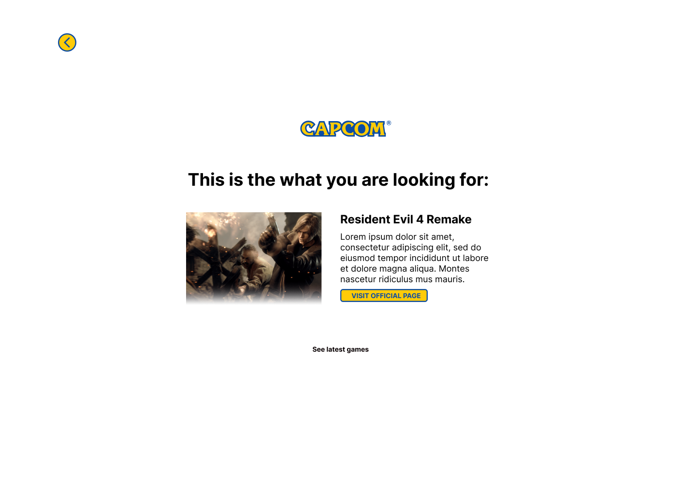

# Unofficial Capcom Advisor

## Motivation

While walking my dog I saw Capcom was closed to my place, and decided to create something and presented to them. I took some of the images of the latest games and decided to create a Capcom Advisor that tells you which is your game by just telling your favourite genre and the platform you usually play on.

## Technologies used

- Qwik and QwikCity
- Splide.js
- Vercel
- TailwindCSS
